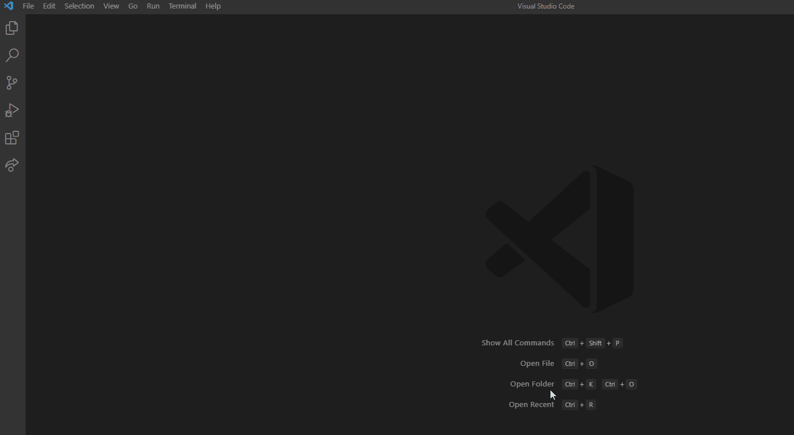

# SWE Flying Start

Welcome to Software Engineering Level 4!

We want to get to know more about you, and what better way than building a webpage to introduce yourself?!

If you need any help with any of the below, that's what we're all here for! You can get help from a fellow apprentice, or any of the coaches. Asking for help at the right time is a very important skill as a developer, so don't be shy.

## Getting set up

We want to get you set up for success. This means getting a few things installed if you haven't already.

 - [VS Code](https://code.visualstudio.com/download) | This is our preferred editor. It integrates with several other technologies we'll be using, and it allows us to jump in and help you with your code remotely using Live Share.
 - [Live Share](https://docs.microsoft.com/en-gb/visualstudio/liveshare/) | As above! Let's get this extension installed. Start up your VS Code and then click *Extensions* from the left menu. Search for Live Share and install the top hit.
 - [Node](https://nodejs.org/en/download/) | When we're building projects in javascript, we'll be using the node runtime. It allows us to run .js files on our computers. When you install Node, you also get npm (node package manager) for free! npm helps us download and use helpful node programs written by other people.
 - [Git](https://git-scm.com/downloads) | Git is what helps us manage different versions of our code. It also helps us share code with others in a safe and structured way. VS Code comes with a built in extension (Source Control) that helps us work with Git.

## Getting started

 1. With the above installed, **make sure you have and are signed in to a GitHub account**. At the top of this repository page, click **Use this template** to create a fork. Doing this will give you your very own copy of this repo!

 

 1. When you are on the homepage of your fork, copy the url.     

 1. Open VS Code and choose *Clone Git Repository*. Paste in the url to copy the code down to your machine.
 
 

 1. Open a terminal (ctrl + ' or ⌘ + ' will open a terminal screen in vscode), `cd` into your project, and type `npm run start` to start the live server.

 1. Now get hacking! Change the html, css and js as much as you like. Put some content for each section, add a picture and add any new sections as you see fit.

## Share your work

Improve your site as much as you like within the time. You're at the beginning of your journey so we don't expect it to be beautiful or complex. Have fun with the css. Add a bit of interactivity if you know how. Look up css animations if you have time to spare. Anything else you can think of - go for it!

When you're done, commit your code and the push the changes to your fork. Share the url with your coach.

##  Other Things

As working in the VSCode development environment will become a substantial part of a developer's day-to-day activities, there are many tools and settings that can increase 'quality of life.'

### Settings

Open VS Code's Command Palette (ctrl+shift+p or ⌘+shift+p).   Type settings.json and select Preferences: Open Settings (JSON)

 

 This will open up a JSON file with a list of settings for VSCode. (Note that like a list, a comma is required at the end of a setting unless it is the last one)

 Add the following:
 "editor.bracketPairColorization.enabled": true

 Look at the these blocks of code.  Can you spot the changes?
 
     

### Themes

There is a marketplace of themes available which can change the look and feel of VSCode (including light and dark modes).  To try out some themes use either (ctrl+ k ctrl + t) (⌘+k ⌘+t) or File-> Preferences -> Color Theme.

Light | Dark
--- | --- 
 | 

